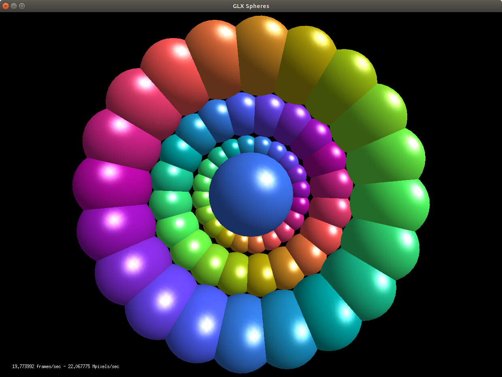
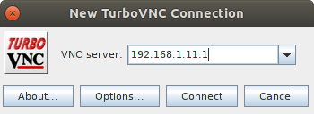

# Ubuntu-18.04 Installation Guide for IBM Power9 - Raptor Talos II Secure Workstation

## Overview

This machine has a V100 GPU installed with 256GB RAM.

In terms of network planning, static IP addresses need to be assigned to:
- BMC: 192.168.1.10
- Host adapter 1: 192.168.1.11
- Host adapter 2: (leave unassigned)

## Procedure

### Step 01.00: Setup

#### Step 01.01: Download and install the OpenBMC tool.

Download the OpenBMC tool from this link:
[Scale-out LC System Event Log Collection Tool](http://www14.software.ibm.com/webapp/set2/sas/f/lopdiags/scaleOutLCdebugtool.html)

The IBM OpenBMC tool is used to interact with the new OpenBMC on the 8335-GTG, 8335-GTC, 8335-GTW, 8335-GTH, and 8335-GTX products.

Pre-requisites:
```
python 3
python 3 requests
```

For RHEL distributions:
[openbmctool-1.14-0.noarch.rpm](http://www14.software.ibm.com/webapp/set2/sas/f/lopdiags/data/openbmctool-1.14-0.noarch.rpm)

For other operating systems:
[openbmctool.zip](http://www14.software.ibm.com/webapp/set2/sas/f/lopdiags/data/openbmctool-1.14.zip)

Download the `openbmctool`:
```bash
wget -q --show-progress --progress=bar:force:noscroll http://www14.software.ibm.com/webapp/set2/sas/f/lopdiags/data/openbmctool-1.14.zip
```

Extract the OpenBMC tool:
```bash
# create directories
sudo mkdir -p /opt/ibm/openbmctool
mkdir ~/bin

# extract
unzip ~/Downloads/openbmctool-1.14.zip -d /opt/ibm/openbmctool

# create a link to the file
ln -s -f /opt/ibm/openbmctool/openbmctool.py ~/bin/openbmctool
```

Create a conda virtual environment:
```bash
conda create -n bmc36 python=3.6
conda activate bmc36

# install required python packages
conda install requests
```

Usage:
```bash
python openbmctool -H <bmc IP> or <bmc hostname> -U <username> -P <password> chassis power status
```


#### Step 01.02: Connect to remote system via BMC

Remote host information:
```bash
export BMC_IP="192.168.1.10"
export BMC_USER="root"
export BMC_PASSWORD="OpenBMC"

SSH RSA fingerprint: 5a:d2:5c:2e:a6:e7:c7:15:b7:d0:cb:ae:24:b7:32:1e
```

Check system status:
```bash
# connect
python openbmctool -H $BMC_IP -U $BMC_USER -P $BMC_PASSWORD chassis power on

Attempting login...
Chassis Power State: Off
Host Power State: Off
BMC Power State: Ready
User root has been logged out
```


Power on the system:
```bash
python openbmctool -H $BMC_IP -U $BMC_USER -P $BMC_PASSWORD chassis power on
```

Login to the BMC `petitboot` shell:
```bash
ssh $BMC_USER@$BMC_IP
root@$BMC_PASSWORD

# console
root@talos:~#

# check version
uname -a
Linux talos 5.0.7-a8a208fa7346ad643e8f6100c49cb7b8468b6d38 #1 Tue Apr 30 18:53:46 UTC 2019 armv6l GNU/Linux
```


#### Step 01.03: Download installation media.

The official Ubuntu images can be downloaded from `http://cdimage.ubuntu.com/releases/18.04.3/release/`


Type the following commands:
```bash
obmcutil poweron
obmc-console-client
```

This should print the following progress message:
```bash
--== Welcome to Hostboot hostboot-3beba24/hbicore.bin ==--

  3.09649|secure|SecureROM valid - enabling functionality
  5.51647|Booting from SBE side 0 on master proc=00050000
  5.56517|ISTEP  6. 5 - host_init_fsi
  5.87670|ISTEP  6. 6 - host_set_ipl_parms
  6.19806|ISTEP  6. 7 - host_discover_targets
...
```

To detatch from console, use the disconnect sequence `<ENTER> ~ .`


Download the installation media using `wget` from the `petitboot` host shell:
```bash
export OS_DISTRO="ubuntu"
export OS_VERSION="18.04.3"
export OS_ARCH="ppc64el"
export OS_IMAGE_TYPE="server"
export ISO_IMAGE="$OS_DISTRO-$OS_VERSION-$OS_IMAGE_TYPE-$OS_ARCH.iso"

# download the iso image
wget http://cdimage.ubuntu.com/releases/$OS_VERSION/release/$ISO_IMAGE -O /tmp/$ISO_IMAGE

# verify the checksum
sha256sum /tmp/$ISO_IMAGE

7497009cd83ba6958f0d2872f6a0c7fe7fcac343cce8ed3d444e691c80735095  /tmp/ubuntu-18.04.3-server-ppc64el.iso
```

Write it to `/dev/sda` with `dd`:
```bash
dd if=/tmp/$ISO_IMAGE of=/dev/sda bs=4M && sync
```

After the image has been written to `/dev/sda`, type `exit` to return to the `petitboot` screen
and select `Install Ubuntu Server`.

```
Petitboot (v1.10.3-pc52bacd)                         T2P9D01 REV 1.01 A1000362
──────────────────────────────────────────────────────────────────────────────
 [USB: sda / 2019-08-05-18-47-03-00]
   Rescue a broken system (HWE)
   Check disc for defects (HWE)
   Install MAAS Rack Controller (HWE)
   Install MAAS Region Controller (HWE)
   Install Ubuntu Server (HWE)
   Rescue a broken system
   Check disc for defects
   Install MAAS Rack Controller
   Install MAAS Region Controller
*  Install Ubuntu Server

 System information
 System configuration
 System status log
 Language
 Rescan devices
 Retrieve config from URL
 Plugins (0)
──────────────────────────────────────────────────────────────────────────────
Enter=accept, e=edit, n=new, x=exit, l=language, g=log, h=help
```


#### Step 01.04: Install operating system.

In the `petitboot` screen, select `Install Ubuntu Server`.

```
Petitboot (v1.10.3-pc52bacd)                         T2P9D01 REV 1.01 A1000362
──────────────────────────────────────────────────────────────────────────────
 [USB: sda / 2019-08-05-18-47-03-00]
   Rescue a broken system (HWE)
   Check disc for defects (HWE)
   Install MAAS Rack Controller (HWE)
   Install MAAS Region Controller (HWE)
   Install Ubuntu Server (HWE)
   Rescue a broken system
   Check disc for defects
   Install MAAS Rack Controller
   Install MAAS Region Controller
*  Install Ubuntu Server

 System information
 System configuration
 System status log
 Language
 Rescan devices
 Retrieve config from URL
 Plugins (0)
──────────────────────────────────────────────────────────────────────────────
Enter=accept, e=edit, n=new, x=exit, l=language, g=log, h=help
```

Setup initial user:
```bash
Real Name: Administrator
Username : administrator
```


Configure the network:
```
┌─────────────────────┤ [!!] Configure the network ├──────────────────────┐
│                                                                         │
│ Your system has multiple network interfaces. Choose the one to use as   │
│ the primary network interface during the installation. If possible,     │
│ the first connected network interface found has been selected.          │
│                                                                         │
│ Primary network interface:                                              │
│                                                                         │
│  enP4p1s0f0: Broadcom Inc. and subsidiaries NetXtreme BCM5719 Giga      │
│  enP4p1s0f1: Broadcom Inc. and subsidiaries NetXtreme BCM5719 Giga      │
│                                                                         │
│     <Go Back>                                                           │
│                                                                         │
└─────────────────────────────────────────────────────────────────────────┘
```


```
┌────────────────────────┤ [!!] Partition disks ├─────────────────────────┐
│                                                                         │
│ The installer can guide you through partitioning a disk (using          │
│ different standard schemes) or, if you prefer, you can do it            │
│ manually. With guided partitioning you will still have a chance later   │
│ to review and customise the results.                                    │
│                                                                         │
│ If you choose guided partitioning for an entire disk, you will next     │
│ be asked which disk should be used.                                     │
│                                                                         │
│ Partitioning method:                                                    │
│                                                                         │
│          Guided - use entire disk                                       │
│          Guided - use entire disk and set up LVM                        │
│          Guided - use entire disk and set up encrypted LVM              │
│          Manual                                                         │
│                                                                         │
│     <Go Back>                                                           │
│                                                                         │
└─────────────────────────────────────────────────────────────────────────┘

<Tab> moves; <Space> selects; <Enter> activates buttons
```

Select disk to write OS to:
```
┌────────────────────────┤ [!!] Partition disks ├─────────────────────────┐
│                                                                         │
│ Note that all data on the disk you select will be erased, but not       │
│ before you have confirmed that you really want to make the changes.     │
│                                                                         │
│ Select disk to partition:                                               │
│                                                                         │
│          /dev/nvme0n1 - 500.1 GB Samsung SSD 960 EVO 500GB              │
│                                                                         │
│     <Go Back>                                                           │
│                                                                         │
└─────────────────────────────────────────────────────────────────────────┘
```

Confirm:
```
┌───────────────────────┤ [!!] Partition disks ├───────────────────────┐
│                                                                      │
│ If you continue, the changes listed below will be written to the     │
│ disks. Otherwise, you will be able to make further changes manually. │
│                                                                      │
│ The partition tables of the following devices are changed:           │
│    /dev/nvme0n1                                                      │
│                                                                      │
│ The following partitions are going to be formatted:                  │
│    partition #2 of /dev/nvme0n1 as ext4                              │
│                                                                      │
│ Write the changes to disks?                                          │
│                                                                      │
│     <Yes>                                                   <No>     │
│                                                                      │
└──────────────────────────────────────────────────────────────────────┘
```

Configure package manager:
```
┌────────────────┤ [!] Configure the package manager ├────────────────┐
│                                                                     │
│ If you need to use a HTTP proxy to access the outside world, enter  │
┌─│ the proxy information here. Otherwise, leave this blank.            │ ┐
│ │                                                                     │ │
│ │ The proxy information should be given in the standard form of       │ │
│ │ "http://[[user][:pass]@]host[:port]/".                              │ │
│ │                                                                     │ │
│ │ HTTP proxy information (blank for none):                            │ │
│ │                                                                     │ │
│ │ ___________________________________________________________________ │ │
└─│                                                                     │ ┘
│     <Go Back>                                        <Continue>     │
│                                                                     │
└─────────────────────────────────────────────────────────────────────┘
```

Configure updates:
```
┌───────────────────────┤ [!] Configuring tasksel ├───────────────────────┐
│                                                                         │
│ Applying updates on a frequent basis is an important part of keeping    │
│ your system secure.                                                     │
│                                                                         │
│ By default, updates need to be applied manually using package           │
│ management tools. Alternatively, you can choose to have this system     │
│ automatically download and install security updates, or you can         │
│ choose to manage this system over the web as part of a group of         │
│ systems using Canonical's Landscape service.                            │
│                                                                         │
│ How do you want to manage upgrades on this system?                      │
│                                                                         │
│                No automatic updates                                     │
│                Install security updates automatically                   │
│                Manage system with Landscape                             │
│                                                                         │
└─────────────────────────────────────────────────────────────────────────┘
```

Select software:
```
┌───────────────────────┤ [!] Software selection ├────────────────────────┐
│                                                                         │
│ At the moment, only the core of the system is installed. To tune the    │
│ system to your needs, you can choose to install one or more of the      │
│ following predefined collections of software.                           │
│                                                                         │
│ Choose software to install:                                             │
│                                                                         │
│                         [ ] DNS server                                  │
│                         [ ] LAMP server                                 │
│                         [ ] Mail server                                 │
│                         [ ] PostgreSQL database                         │
│                         [ ] Print server                                │
│                         [ ] Samba file server                           │
│                         [*] OpenSSH server                              │
│                                                                         │
│                               <Continue>                                │
│                                                                         │
└─────────────────────────────────────────────────────────────────────────┘
```

Finish installation:
```
┌───────────────────┤ [!!] Finish the installation ├────────────────────┐
│                                                                       │
┌│                         Installation complete                         │
││ Installation is complete, so it is time to boot into your new system. │
││ Make sure to remove the installation media (CD-ROM, floppies), so     │
││ that you boot into the new system rather than restarting the          │
││ installation.                                                         │
││                                                                       │
└│     <Go Back>                                          <Continue>     │
│                                                                       │
└───────────────────────────────────────────────────────────────────────┘
```

After rebooting the system, you should be presented with the following screen:
```
Petitboot (v1.10.3-pc52bacd)                         T2P9D01 REV 1.01 A1000362
──────────────────────────────────────────────────────────────────────────────
 [Disk: nvme0n1p2 / d6b351e5-e523-4111-a2f2-fd560adf24e0]
   Ubuntu, with Linux 4.15.0-55-generic (recovery mode)
   Ubuntu, with Linux 4.15.0-55-generic
   (*) Ubuntu

 System information
 System configuration
 System status log
 Language
 Rescan devices
 Retrieve config from URL
 Plugins (0)
*Exit to shell


──────────────────────────────────────────────────────────────────────────────
Enter=accept, e=edit, n=new, x=exit, l=language, g=log, h=help
```

**Note:** Because `petitboot` provides a serial terminal interface instead of a VGA graphical terminal, you might need to append a kernel boot argument in GRUB in order to successfully boot. Use the arrow keys to navigate to the "Debian GNU/Linux" entry, then type "e". Use the arrow keys to navigate to the "Boot arguments" field, then append the following text to that line

```bash
console=tty0 console=ttyS0,115200n8
```

```
Petitboot Option Editor
──────────────────────────────────────────────────────────────────────────────

Device:         (*) nvme0n1p2 [d6b351e5-e523-4111-a2f2-fd560adf24e0]
                ( ) Specify paths/URLs manually

Kernel:         /boot/vmlinux-4.15.0-55-generic
Initrd:         /boot/initrd.img-4.15.0-55-generic
Device tree:
Boot arguments: root=UUID=d6b351e5-e523-4111-a2f2-fd560adf24e0 ro console=tty0 console=ttyS0,115200n8

                [    OK    ]  [   Help   ]  [  Cancel  ]


──────────────────────────────────────────────────────────────────────────────
tab=next, shift+tab=previous, x=exit, h=help
```

This should start the boot process and present you with a login prompt:
```bash
Ubuntu 18.04.3 LTS talos2 hvc0

talos2 login:
```

Login as `administrator`:
```
talos2 login: administrator
Password:

Welcome to Ubuntu 18.04.3 LTS (GNU/Linux 4.15.0-55-generic ppc64le)

 * Documentation:  https://help.ubuntu.com
 * Management:     https://landscape.canonical.com
 * Support:        https://ubuntu.com/advantage

  System information as of Sat Aug 10 23:21:32 EDT 2019

  System load:  0.11               Processes:                 1143
  Usage of /:   0.8% of 457.44GB   Users logged in:           0
  Memory usage: 0%                 IP address for enP4p1s0f0: 192.168.1.10
  Swap usage:   0%

0 packages can be updated.
0 updates are security updates.


The programs included with the Ubuntu system are free software;
the exact distribution terms for each program are described in the
individual files in /usr/share/doc/*/copyright.

Ubuntu comes with ABSOLUTELY NO WARRANTY, to the extent permitted by
applicable law.

To run a command as administrator (user "root"), use "sudo <command>".
See "man sudo_root" for details.

administrator@talos2:~$
```


Configure network interfaces by editing `/etc/netplan/01-netcfg.yaml`

```bash
sudo /etc/netplan/01-netcfg.yaml
```

We will use IP address `192.168.1.11/24` for host adapter 1 and gateway address `192.168.1.1`.

Add the following entries:
```yaml
# This file describes the network interfaces available on your system
# For more information, see netplan(5).
network:
  version: 2
  renderer: networkd
  ethernets:
    enP4p1s0f0:
      addresses: [ 192.168.1.11/24 ]
      gateway4: 192.168.1.1
      nameservers:
          addresses:
              - "8.8.8.8"
              - "8.8.4.4"
```

Restarting/testing networking
With the new method, you must restart networking using `netplan`. Once you've configured your interface, issue the following command:

```bash
sudo netplan apply
```
The above command will restart networking and apply the new configuration. You shouldn't see any output. If networking fails to function properly, you can issue the command:

```bash
sudo netplan --debug apply
```

```bash
sudo netplan --debug apply
** (generate:4670): DEBUG: 00:12:27.907: Processing input file /etc/netplan/01-netcfg.yaml..
** (generate:4670): DEBUG: 00:12:27.907: starting new processing pass
** (generate:4670): DEBUG: 00:12:27.907: enP4p1s0f0: setting default backend to 1
** (generate:4670): DEBUG: 00:12:27.907: Configuration is valid
** (generate:4670): DEBUG: 00:12:27.907: Generating output files..
** (generate:4670): DEBUG: 00:12:27.908: NetworkManager: definition enP4p1s0f0 is not for us (backend 1)
DEBUG:netplan generated networkd configuration changed, restarting networkd
DEBUG:no netplan generated NM configuration exists
DEBUG:enP4p1s0f0 not found in {}
DEBUG:Merged config:
network:
  bonds: {}
  bridges: {}
  ethernets:
    enP4p1s0f0:
      addresses:
      - 192.168.1.11/24
      gateway4: 192.168.1.1
      nameservers:
        addresses:
        - 8.8.8.8
        - 8.8.4.4
  vlans: {}
  wifis: {}

DEBUG:Skipping non-physical interface: lo
DEBUG:device enP4p1s0f0 operstate is up, not changing
DEBUG:Skipping non-physical interface: enP4p1s0f1
DEBUG:{}
DEBUG:netplan triggering .link rules for lo
DEBUG:netplan triggering .link rules for enP4p1s0f0
DEBUG:netplan triggering .link rules for enP4p1s0f1

administrator@talos2:/etc/netplan$ packet_write_wait: Connection to 192.168.1.10 port 22: Broken pipe
```

If you lose you connection to an ssh session, type the following commands:
```
ssh root@$BMC_IP
root@192.168.1.10's password:
root@talos:~#

obmcutil poweron
obmc-console-client
```


Re-login using ssh:
```
HOST_ADAPTER1_IP="192.168.1.11"
USER="administrator"
PASSWORD="password"

# login
ssh $USER@$HOST_ADAPTER1_IP
administrator@192.168.1.11's password:
Welcome to Ubuntu 18.04.3 LTS (GNU/Linux 4.15.0-55-generic ppc64le)

 * Documentation:  https://help.ubuntu.com
 * Management:     https://landscape.canonical.com
 * Support:        https://ubuntu.com/advantage

  System information as of Sat Aug 10 23:43:15 EDT 2019

  System load:  0.0                Processes:                 1152
  Usage of /:   0.8% of 457.44GB   Users logged in:           1
  Memory usage: 0%                 IP address for enP4p1s0f0: 192.168.1.10
  Swap usage:   0%


0 packages can be updated.
0 updates are security updates.

Failed to connect to https://changelogs.ubuntu.com/meta-release-lts. Check your Internet connection or proxy settings


Last login: Sat Aug 10 23:21:32 2019
```


Modify `/etc/resolv.conf`:
```bash
sudo nano /etc/resolv.conf
```

Add the following entries:
```bash
# Use Google's public DNS servers.
nameserver 8.8.4.4
nameserver 8.8.8.8
options edns0
```

Now try to ping google servers:
```bash
ping www.google.com
PING www.google.com (211.10.201.200) 56(84) bytes of data.
64 bytes from sof01s99-us-f200.5e100.net (211.10.201.200): icmp_seq=1 ttl=51 time=97.8 ms
64 bytes from sof01s99-us-f200.5e100.net (211.10.201.200): icmp_seq=2 ttl=51 time=97.7 ms
64 bytes from sof01s99-us-f200.5e100.net (211.10.201.200): icmp_seq=3 ttl=51 time=97.8 ms
```


#### Step 01.05: Install additional packages.

In Ubuntu, the opal-prd (Processor Runtime Diagnostics) package that is required for runtime detection and handling of Power processor errors on systems that are running OpenPower firmware is not installed by default. Run the following command to install this package:
```bash
sudo apt-get install opal-prd
```

Install compilers and build tools:
```bash
sudo apt-get install localepurge
sudo apt-get install build-essential dkms pkg-config pkg-config
```
---

### Step 02.00: Install graphics drivers.

#### Step 02.01: Install Gnome desktop

We're going to use `tasksel` for the installation of the GNOME desktop. `tasksel` is a Ubuntu and Debian-specific tool, which helps to install multiple related packages as a coordinated task.

```bash
sudo apt-get install tasksel -y
```

Once the above command completes, issue the command:
```bash
sudo tasksel
```

A curses-based GUI will open. Using the keyboard arrow keys, scroll down to select Ubuntu desktop.
```bash
Package configuration

    ┌───────────────────────┤ Software selection ├────────────────────────┐
    │ You can choose to install one or more of the following predefined   │
    │ collections of software.                                            │
    │                                                                     │
    │ Choose software to install:                                         │
    │                                                                     │
    │    [ ] PostgreSQL database                                      ↑   │
    │    [ ] Print server                                             ▒   │
    │    [ ] Samba file server                                        ▒   │
    │    [ ] Ubuntu Budgie desktop                                    ▒   │
    │    [*] Ubuntu desktop                                           ▮   │
    │    [ ] Ubuntu MATE minimal                                      ▒   │
    │    [ ] Ubuntu MATE desktop                                      ▒   │
    │    [ ] Audio recording and editing suite                        ▒   │
    │    [ ] Ubuntu Studio desktop                                    ↓   │
    │                                                                     │
    │                                                                     │
    │                               <Ok>                                  │
    │                                                                     │
    └─────────────────────────────────────────────────────────────────────┘
```

You also alternatively directly install the Gnome desktop using the following command:
```bash
sudo tasksel ubuntu-desktop -y
```

Once you've selected Ubuntu desktop, click the spacebar to select it, tab down to Ok, and hit Enter on your keyboard. This will install everything necessary for a successful GNOME desktop on Ubuntu Server. When the process completes, reboot the server.
```bash
sudo reboot -i NOW
```

#### Step 02.02: Install NVIDIA graphics drivers.

The recommended procedure is to install the NVIDIA CUDA-10.1 package, which includes a more recent version of the NVIDIA proprietary graphics drivers (418.87), as opposed to the standalone proprietary graphics driver installer package for `ppc64el` (418.67).

[Ubuntu-18.04 Installation Guide for IBM Power9 - Raptor Talos II Secure Workstation - Install NVIDIA Graphics, CUDA, cuDNN and TensorRT libraries](./ubuntu-18.04-install-power9-raptor-talos-ii-nvidia-graphics-cuda-cudnn-tensorrt.md)

Install the standalone NVIDIA proprietary graphics driver package, only if you don't plan to use CUDA. You can install CUDA later, and it will automatically upgrade the NVIDIA graphics drivers.

[Optional:] [Ubuntu-18.04 Installation Guide for IBM Power9 - Raptor Talos II Secure Workstation - Install NVIDIA proprietary graphics drivers using standalone installer](ubuntu-18.04-install-power9-raptor-talos-ii-nvidia-proprietary-graphics-drivers-standalone-installer.md)


#### Step 02.03: Configure headless 3D GPU acceleration using an NVIDIA GPU.

In order to configure headless 3D GPU acceleration, you'll have to use VirtualGL with TurboVNC.

VirtualGL works fine with headless NVIDIA GPUs (Tesla), but there are a few additional steps that need to be performed in order to run a headless 3D X server on these GPUs.

These steps should be performed after installing the NVIDIA proprietary driver, but before configuring VirtualGL.

[Ubuntu-18.04 - Configure headless 3D GPU acceleration using an NVIDIA GPU](./ubuntu-18.04-configure-headless-3d-gpu-acceleration-using-nvidia-gpu.md)


#### Step 02.05: Install Vulkan SDK.

**Note:** While the procedure outlined below is generally correct, the current version of the
NVIDIA drivers (418.67) for `ppc64el` doesn't have support for Vulkan rendering. You will have
to wait for a newer driver (e.g. 430.40 or higher).

[Ubuntu-18.04 - Compile Vulkan SDK for ppc64el](./ubuntu-18.04-compile-vulkan-sdk-for-ppc64el.md)

---

### Step 03.00: Create users and groups on the remote server.

The user name on both the remote system and the local client system should match
for remote desktop access to work using VirtualGL and TurboVNC.

We'll create a new user `developer`, apart from the default `administrator`
user on the remote server.

#### Step 03.01: Create a new group on the remote server.

Create a group:
```bash
GROUP='developers'
GID='65536'
sudo addgroup --gid $GID $GROUP
```

#### Step 03.02: Create a new user on the remote server.

Create a user:
```bash
USER='developer'
UID='1002'

# create user
sudo adduser --home /home/$USER --uid $UID $USER

# add the user to groups
sudo adduser $USER $GROUP
sudo adduser $USER users
sudo adduser $USER dialout
sudo adduser $USER plugdev
sudo adduser $USER audio
sudo adduser $USER video
sudo adduser $USER vglusers

# grant the user sudo privileges
sudo visudo

developer   ALL=(ALL:ALL) ALL
```

Logout and login for the group memberships to take effect.

#### Step 03.03: Create group `vglusers` on the client machine.

Create the group `vglusers` and add the user `developer` to the `vglusers` group on the client machine,
so that the remote user `developer` also belongs to group `vglusers` when accessing the remote server
for VirtualGL and X11 forwarding permissions to work properly.
```bash
# create group vglusers
GROUP='vglusers'
GID='1001'
sudo addgroup --gid $GID $GROUP

# add remote desktop user to vglusers
USER='developer'
UID='1002'
sudo adduser $USER vglusers
```

#### Step 03.04: Configure ssh for remote desktop access.

Follow [these steps](./ubuntu-18.04-configure-ssh-and-x11-forwarding-for-remote-desktop-access.md) to configure SSH and X11 forwarding for remote desktop access.

Test X11 forwarding using SSH:
```bash
HOST_ADAPTER1_IP="192.168.1.11"
USER="developer"

# run xeyes application
ssh -X $USER@$HOST_ADAPTER1_IP xyes
```

---

### Step 04.00: Setup and configure remote desktop access.

You will need to build libjpeg-turbo, VirtualGL and TurboVNC from sources and
configure VirtualGL to work with a display manager.

You can opt to use any one of the following display managers:
- `gmd3` (default for Ubuntu-18.04), or
- `lightdm` (requires manual installation for Ubuntu-180.04).


#### Step 04.01: Build libjepg-turbo, VirtualGL and TurboVNC from sources.

Follow [these steps](./ubuntu-18.04-compile-libjpeg-turbo-virtualgl-turbovnc.md) to compile libjpeg-turbo, VirtualGL and TurboVNC from sources for `ppc64el`.

#### Step 04.02: Configure VirtualGL and TurboVNC with gdm3,

Follow [these steps](./ubuntu-18.04-configure-virtualgl-turbovnc-gdm3.md) to configure VirtualGL and TurboVNC with `gdm3`.

#### Step 04.03: [Optional] Configure VirtualGL and TurboVNC with lightdm.

Follow [these steps](./ubuntu-18.04-configure-virtualgl-turbovnc-lightdm.md) to configure VirtualGL and TurboVNC with `lightdm`.

#### Step 04.04: Update your `~/.bashrc` file

Edit `~/.bashrc`:
```bash
nano ~/.bashrc
```

```bash
# Set locate
export LC_ALL="en_US.UTF-8"
export LANG="en_US.UTF-8"

# shell
export PS1="${debian_chroot:+($debian_chroot)}\u:\W\$ "

# host
export CPU_ARCHITECTURE=$(uname -m)

# NVIDIA CUDA environment variables
CUDA_VERSION=10.1
CUDNN_VERSION=7.6.2.24
NCCL_VERSION=2.4.7-1
CUDA=/usr/local/cuda-${CUDA_VERSION}

## NVIDIA TensorRT environment variables
TENSORRT_VERSION=5.1.5.0
TENSORRT=/project/software/library/TensorRT-$TENSORRT_VERSION

# VirtualGL, TurboVNC
LIBTURBO_JPEG_DIR="/opt/libjpeg-turbo"
VIRTUALGL_DIR="/opt/VirtualGL"
TURBOVNC_DIR="/opt/TurboVNC"
export TVNC_MT=1
export TVNC_NTHREADS=32

# Vulkan
VULKAN_SDK_VERSION="1.1.114.0"
export VULKAN_SDK="/project/software/library/vulkan/${VULKAN_SDK_VERSION}/$CPU_ARCHITECTURE"
export VK_LAYER_PATH="${VULKAN_SDK}/etc/explicit_layer.d"

export LD_LIBRARY_PATH="${CUDA}/lib64:${CUDA}/extras/CUPTI/lib64:${TENSORRT}/lib:${VULKAN_SDK}/lib:${LIBTURBO_JPEG_DIR}/lib64${LD_LIBRARY_PATH:+:${LD_LIBRARY_PATH}}"
export PATH="${HOME}/bin:${CUDA}/bin:${VULKAN_SDK}/bin:${VIRTUALGL_DIR}/bin:${TURBOVNC_DIR}/bin${PATH:+:${PATH}}"
```

Source `~/.bashrc` to set environment variable:
```bash
source ~/.bashrc
```

#### Step 04.04: Make a VirtualGL connection.

Launch `vmcserver` on the remote host:
```bash
/opt/TurboVNC/bin/vncserver

Desktop 'TurboVNC: talos2:1 (developer)' started on display talos2:1

Starting applications specified in /home/developer/.vnc/xstartup.turbovnc
Log file is /home/developer/.vnc/talos2:1.log
```

This creates `DISPLAY=:1`


Use `vglconnect` to make a VirtualGL connection to run a single application remotely:
```bash
# connect using ssh
vglconnect -s $USER@$HOST_ADAPTER1_IP
```

This will make a connection with ssh-encrypted X-forwarding and VGL Image transport.
For more detail about options see[ VirtualGL Reference](https://docs.oracle.com/cd/E19279-01/820-3257-12/VGL.html).
```bash
VirtualGL Client 64-bit v2.6.2 (Build 20190812)
Listening for SSL connections on port 4243
Listening for unencrypted connections on port 4242
Redirecting output to /home/developer/.vgl/vglconnect--:1.log

Making preliminary SSH connection to find a free port on the server ...
Making final SSH connection ...

# check the display environment variable
echo $DISPLAY
localhost:10.0

echo $VGL_DISPLAY
```

Run an OpenGL application using the vglrun command using the `DISPLAY:1` created by the `vncserver`:
```bash
vglrun -d :1 glxinfo
vglrun -d :1 glxgears

# performance test
VGL_LOGO=1 vglrun -d :1 glxgears

# debug connection using verbose mode
VGL_TRACE=1 vglrun +v -d :1 glxgears
```

Run the `/opt/VirtualGL/bin//glxspheres64` performance test:
```bash
vglrun -d :1 glxspheres64
```

<figure>
  
  <figcaption>Figure 01: glxspheres64 app rendered locally using VirtualGL </figcaption>
</figure>

#### Step 04.04: Test remote desktop access using TurboVNC.

Login to the remote server:
```bash
ssh -XY $USER@$HOST_ADAPTER1_IP
```

Start a VNC server session on the remote visualization station using the command:
```bash
vncserver
```

You will be prompted to set (and confirm) a password. If it was successful, you will obtain something like this:
```bash
Desktop 'TurboVNC: talos2:1 (developer)' started on display talos2:1

Starting applications specified in /home/developer/.vnc/xstartup.turbovnc
Log file is /home/developer/.vnc/talos2:1.log
```

The important thing here is the last number in the first line (after the colon i.e. talos2:1)
- the display number (1 in this case), by adding 5900 to it we’ll obtain the port number of the VNC (in this case 1 + 5900 = 5901).

You can always check this by using the command `vncserver -list`:
```bash
vncserver -list

TurboVNC sessions:

X DISPLAY #	PROCESS ID
:1		17078
```

You can now disconnect from the remote server.
```bash
exit
```

You can now connect to the remote server using `vncviewer --extssh=1`, which will automatically create an ssh tunnel and do port forwarding.

Type the following command to launch the vncviwer gui and specify `$HOST_ADAPTER1_IP:<DISPLAY>` in the VNC Server field.
```bash
# launches vncviwer gui
vncviewer --extssh=1
```

<figure>
  
  <figcaption>Figure 02: New TurboVNC connection prompt</figcaption>
</figure>


---

## Issues

01. [Compiler error on Ubuntu Linux with Nvidia Drivers: No rule to make target `/usr/lib/x86_64-linux-gnu/libGL.so' #2087 - RobotLocomotion/drake](https://github.com/RobotLocomotion/drake/issues/2087)

02. [Not creating vgl_xauth_key when using gdm3 in ubuntu server #65](https://github.com/VirtualGL/virtualgl/issues/65)

02. [gdm does not run /etc/gdm/*/Default scripts properly!](https://gitlab.gnome.org/GNOME/gdm/issues/317)

---

## Repositories

01. [openbmc/obmc-console](https://github.com/openbmc/obmc-console)
> OpenBMC host console infrastructure.

02. [github.com/openssl/openssl](https://github.com/openssl/openssl)
> TLS/SSL and crypto library.

---

## Technotes

### OpenBMC

01. [Installing Ubuntu on IBM Power System POWER9 servers with a USB device - IBM](https://www.ibm.com/support/knowledgecenter/en/linuxonibm/liabw/ubuntuqs_guide_Power9_usb.html)

02. [Accessing the Management interface of a Power Systems AC922 - Andrew Laidlaw - 201903061200](https://medium.com/@andrewlaidlawpower/accessing-the-management-interface-of-a-power-systems-ac922-67b5ad30411)

03. [Downloading and installing the OpenBMC tool - IBM](https://www.ibm.com/support/knowledgecenter/9006-22P/p9eih/p9eih_openbmc_tool.htm)

04. [Scale-out LC System Event Log Collection Tool - IBM](http://www14.software.ibm.com/webapp/set2/sas/f/lopdiags/scaleOutLCdebugtool.html)

### Networking

01. [DNS on Ubuntu 18.04 - Andrew B. Collier](https://datawookie.netlify.com/blog/2018/10/dns-on-ubuntu-18.04/)

02. [How to configure a static IP address in Ubuntu Server 18.04 - TechRepublic](https://www.techrepublic.com/article/how-to-configure-a-static-ip-address-in-ubuntu-server-18-04/)

### Ubuntu

01. [How to install the GNOME Desktop on Ubuntu Server 18.04 - TechRepublic](https://www.techrepublic.com/article/how-to-install-the-gnome-desktop-on-ubuntu-server-18-04/)

02. [Install GUI on Ubuntu Server 18.04 Bionic Beaver - Lubos Rendek -  LinuxConfig](https://linuxconfig.org/install-gui-on-ubuntu-server-18-04-bionic-beaver)

03. [How to Remove or Delete PPA in Ubuntu - It's FOSS](https://itsfoss.com/how-to-remove-or-delete-ppas-quick-tip/)

### libjpeg-turbo

01. [Compile and use libjpeg-turbo on ubuntu 16.04](https://kezunlin.me/post/9f626e7a/)

### VirtualGL

01. [Headless nVidia Mini How-To - VirtualGL](https://virtualgl.org/Documentation/HeadlessNV)

02. [How to set up VirtualGL and TurboVNC for use with ParaViewWeb - Kitware](https://kitware.github.io/paraviewweb/docs/virtualgl_turbovnc_howto.html)

03. [Remote accelerated graphics with VirtualGL and TurboVNC - Jan Hreha - 20150804](https://summerofhpc.prace-ri.eu/remote-accelerated-graphics-with-virtualgl-and-turbovnc/)

### ROS

01. [Building ROS1 Melodic Morena](http://wiki.ros.org/melodic/Installation/Source)
02. [Building ROS2 Dashing Diademata on Linux](https://index.ros.org/doc/ros2/Installation/Dashing/Linux-Development-Setup/)

---

## Related Topics

### Ubuntu

01. [How to create a bootable Ubuntu USB flash drive from terminal? - Ubuntu](https://askubuntu.com/questions/372607/how-to-create-a-bootable-ubuntu-usb-flash-drive-from-terminal)

## EGL

01. [How do I get EGL and OpenGLES libraries for Ubuntu running on VirtualBox?](https://askubuntu.com/questions/244133/how-do-i-get-egl-and-opengles-libraries-for-ubuntu-running-on-virtualbox/821812)

## X11

01. X11 connection rejected because of wrong authentication [](https://community.hpe.com/t5/Networking/X11-connection-rejected-because-of-wrong-authentication/td-p/6987197#.XVLrQXUzbds)

Solution:
Set `X11UseLocalhost` variable to `no` in the file `/etc/opt/ssh/sshd_config`

## VirtualGL

01.[vgl transport: '[VGL] ERROR: Could not open display :0.'](https://virtualgl-users.narkive.com/kUckmG7X/vgl-transport-vgl-error-could-not-open-display-0)
